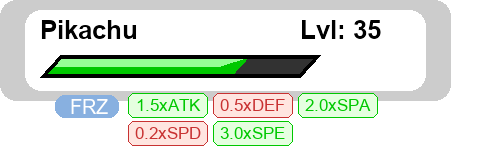

# Pokémon Battle HUD Generator  

A Python script that generates a Pokémon-style battle HUD (Heads-Up Display) using the Python Imaging Library (PIL).  

  

## Features  
- Customizable Pokémon name and level  
- Dynamic HP bar with color changes based on remaining HP  
- Status condition display (PAR, BRN, PSN, TOX, SLP, FRZ)  
- Stat change indicators (boosts/reductions)
- Field hazard display (Stealth Rock, Spikes, Toxic Spikes, Sticky Web)
- Screen and field condition indicators (Reflect, Light Screen, Aurora Veil, Tailwind, etc.)
- Clean, rounded UI elements  

## Requirements  
- Python 3.x  
- Pillow (PIL) library  

## Installation  
```bash
pip install pillow
```

## Usage  
```python
from pokemon_hud import generate_hud

# Generate a HUD image
img = generate_hud(
    name="Pikachu",
    level=35,
    current_hp=75,
    max_hp=100,
    status="FRZ",  # Optional status condition
    stat_changes={  # Optional stat changes
        "ATK": 1.5, 
        "DEF": 0.5,
        "SPA": 2.0,
        "SPD": 0.25,
        "SPE": 3.0
    }
)

# Save the image
img.save("pokemon_hud.png")
```

## Parameters  
| Parameter      | Type   | Description                          | Required |
|---------------|--------|--------------------------------------|----------|
| `name`        | str    | Pokémon name                         | Yes      |
| `level`       | int    | Pokémon level                        | Yes      |
| `current_hp`  | int    | Current HP value                     | Yes      |
| `max_hp`      | int    | Maximum HP value                     | Yes      |
| `status`      | str    | Status condition (PAR/BRN/PSN/etc.)  | No       |
| `stat_changes`| dict   | Dictionary of stat modifiers         | No       |
| `hazards`      | dict | Field hazards (Stealth Rock, Spikes, etc.)     | No       |
| `screens`      | dict | Field/screen effects (Reflect, Tailwind, etc.) | No       |

## Stat Change Format  
Pass stat changes as a dictionary with keys:  
- `HP`, `ATK`, `DEF`, `SPA`, `SPD`, `SPE`  

Values should be multipliers (e.g., `1.5` for +1 stage, `0.5` for -1 stage)  

## Hazards Format

Example:

```python
hazards = {
    "rocks": True,
    "spikes": 3,         # 1–3 layers
    "toxic_spikes": 2,   # 1–2 layers
    "sticky_web": True
}
```

Each enabled hazard is represented visually on the HUD beneath the Pokémon’s HP bar.

## Screens Format

Example:

```python
screens = {
    "reflect": True,
    "light_screen": True,
    "aurora_veil": False,
    "tailwind": True
}
```

## Customization  
You can modify:  
- Colors in the constants section  
- Fonts (defaults to Arial, falls back to system default)  
- Dimensions and positioning of elements  

## Example Output  
The included example generates a HUD for a level 35 Pikachu with:  
- 75/100 HP  
- Frozen status  
- Stat changes:  
  - ATK +1.5x  
  - DEF -0.5x  
  - SPA +2.0x  
  - SPD -0.25x  
  - SPE +3.0x  
## Returns
The final hud image is returned

## License  
MIT License - Free for personal and commercial use

## Attribution Requirement  

If you use this code in your project (modified or unmodified), you **must** include:  

1. **Visible credit** in your project's documentation/README with:  
   ```
   Pokémon HUD Generator by Crazy Pokeking / Crazy-Ledend 
   ```  

2. **A link back** to this repository:  
   ```
   https://github.com/Crazy-Ledend/Health-Bar
   ```  

**Example Attribution:**  
> "This project uses the Pokémon HUD Generator by Crazy Pokeking / Crazy-Ledend.  
> Source: [github.com/Crazy-Ledend/Health-Bar](https://github.com/Crazy-Ledend/Health-Bar)"  
